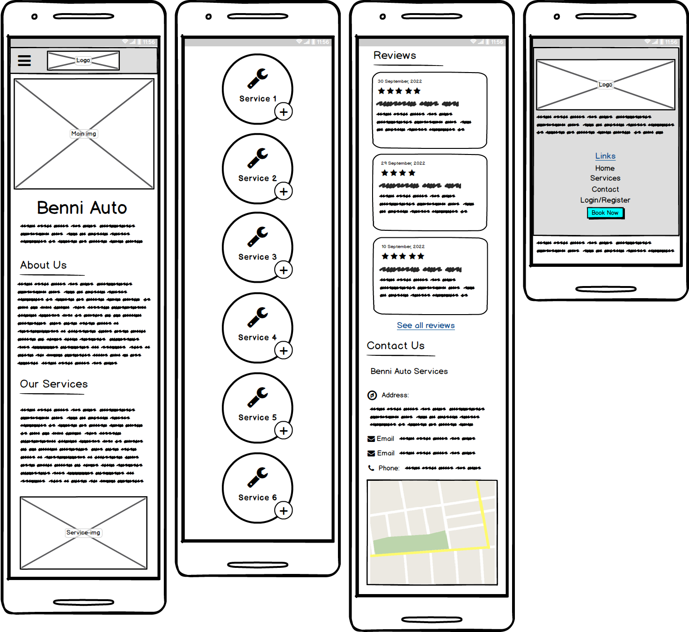

# Benni Auto
benni auto is a sample website for an auto service shop to manage their orders and develop their business.
Also, It has an opportunity for users to view the reviews or login to the website and book their service orders and leave comment.  

You can find the live site [here](https://benniauto-b1eb6496d00c.herokuapp.com/)
-


---
---
# Contents
+ [User Experience](#user-experience)
  + [User Stories](#user-stories)
  + [Design](#design)
    + [Overall Feel](#overall-feel)
    + [Color Scheme](#color-scheme)
    + [Typography](#typography)
    + [Imagery](#imagery)
  + [Wireframes](#wireframes)
    + [Wireframes](#wireframes)
+ [Features](#features)
  + [Current Features](#current-features)
  + [Possible Future Features](#possible-future-features)
+ [Database](#database)
+ [Technologies Used](#technologies-used)
  + [Languages](#languages)
  + [Frameworks and Libraries](#frameworks-and-libraries)
  + [All Others](#all-others)
+ [Testing](#testing)
+ [Deployment](#deployment)
  + [Heroku Deployment](#heroku-deployment)
  + [Forking the Repository](#forking-the-repository)
  + [Making a Local Clone](#making-a-local-clone)
+ [Credits](#credits)
  + [Content](#content)
  + [Acknowledgements](#acknowledgements)
---
---
# User Experience
## User Stories
### As a casual user: 
+ I want to be able to view services without having to register and account. 
+ I want to be able to view reviews of other users without having to register and account.
+ I want to be able to access the contact information and location of service shop.
+ I want to have the option to register an account if I want to come back later. 
### As a returning user: 
+ I want to be able to log into my account.
+ I want to be able to log out from my account.
+ I want to be able to book a new service order. 
+ I want to be able to view my last service orders. 
+ I want to be able to change or cancel my service orders and write my cancelation reason. 
+ I want to be able to view all reviews and write reviews. 
+ I want to be able to delete my reviews. 
### As the site owner/admin:
+ I want to be able to add new services to the site.
+ I want the new services to be added to the appropriate site areas.
+ I want to be able to edit or delete the pre-existing services.
+ I want to be able to delete any orders (especially the canceled one).
+ I don't want to be able to delete any reviews.

 
## Design
### Overall Feel

For this project I wanted to have a light feel to emulate a light-time setting. 

### Color Scheme


### Typography

There were two font that I was interested in for the site: 
- [Signika Negative](https://fonts.google.com/specimen/Signika+Negative?preview.text=Benni%20Auto&query=Signika+Negative) by [Google-Font](https://fonts.google.com/) fit perfectly with the light theme of website. 
- also Sans-Serif is used as a backup font, in case for any reason the main font isn't being imported into the site correctly.

### Imagery

Imagery is an important part of the user experience.  for this website I used three types of images:
- Graphic photo which is used for the main page photo and describes the purpose of the website
- Vector image which is used in main page and for service section. it is edited and adopted to website color theme. 
- real images which are used in service page to describe each service. 

## Wireframes
### Wireframes
All Wireframes were designed for laptop/computer, iPad/tablet and phone display.
Wireframes were produced using Balsamiq.
#### Home page
 <details>
 <summary>Desktop/Laptop Wireframe of Home Page</summary>


 </details>

 <details>
 <summary>Tablet/iPad Wireframe of Home Page</summary>


 </details>

 <details>
    <summary>Smart phone Wireframe of Home Page</summary>


 </details>

#### Services Page
 <details>
 <summary>Desktop/Laptop Wireframe of Service Page</summary>


 </details>

 <details>
 <summary>Tablet/iPad Wireframe of Service Page</summary>


 </details>

 <details>
    <summary>Smart phone Wireframe of Service Page</summary>


 </details>

 #### Login/Register Page
 <details>
 <summary>Desktop/Laptop Wireframe of Login/Register Page</summary>


 </details>

 <details>
 <summary>Tablet/iPad Wireframe of Login/Register Page</summary>


 </details>

 <details>
    <summary>Smart phone Wireframe of Login/Register Page</summary>


 </details>

#### Book Appointment Page
 <details>
 <summary>Desktop/Laptop Wireframe of Book Appointment Page</summary>


 </details>

 <details>
 <summary>Tablet/iPad Wireframe of Service Page</summary>


 </details>

 <details>
    <summary>Smart phone Wireframe of Service Page</summary>


 </details><br>


# Features
## Current Features
### **Navigation menu displayed across all pages**

The navigation menu will help the user move easily across all pages.
The navigation buttons update depending on whether a user is logged in, and whether that user is the admin:

| Nav Link              |Not logged in  |Logged in as user|Logged in as admin
|:-------------         |:------------- |:------------- |:------------- |
|Logo(back to home)     |&#9989;        |&#9989;        |&#9989;
|Home                   |&#9989;        |&#9989;        |&#9989;
|Services               |&#9989;        |&#9989;        |&#9989;
|Contact                |&#9989;        |&#9989;        |&#9989;
|Login/Register         |&#9989;        |&#10060;       |&#10060;
|Log Out                |&#10060;       |&#9989;        |&#9989;
|Book Now               |&#9989;(login) |&#9989;        |&#9989;

### **All Services and reviews are accessible to users who don't want to make an account**

As someone who doesn't particularly like to sign up to websites there is possibility to see the services and their contents and the reviews page too. 

### **Reviews**

Anyone can see the users’ reviews. the reviews are included title of review, Rating, Description, and the username of the user who wrote that. 
The last three written reviews appear in the home page. but for writing a review the users have to login first. the reviews are sorted by date created and user can see the date of review.


### **User account management**

Anyone can make an account through the 'Register' page. They must choose a username and a password. Measures have been put in place so that the user cannot choose a username or email that is already taken.
Also, users are asked to re-write their password to confirm they wrote it right. even they can click on eye icon to unveil the password if needed. 


### **User orders management**

  + **Adding**: A registered users can book service order to the orders page on their own names. Once they have order that they have added, all order management can be accessible there. This includes editing or canceling them. These orders can be shown just for Admin and the owner of the service orders. in order request form, the users must determine the requested services and the brand of their car from the options.
  Also, the users are asked to choose the appointment date. if the users need the recovery service to pick up their car, they must switch on the need recovery icon. as soon as the need recovery switched on, the users must fill their address. 

  + **Editing**: The user will have to go into the edit order page through the order page, make the necessary changes and confirm them at the bottom of the page. The user also has the option to cancel all changes. These steps assure that the user cannot do any of this by mistake.

  + **Canceling**: when the order placed, the users have option to cancel their order by submitting the cancel description. After the order requested to be canceled, at the top row of the order the word "Canceled" will be shown up.
 
### **User reviews management**

  + **Adding**: A registered users can leave a comment for the services. they can rate it from 1 star to 5 stars. and describe and share their experience with others. 

  + **Deleting**: Only the user who owns that written comment can delete it. By pressing the delete button the confirmation box will be shown up and after clicking the delete button again the review will be deleted permanently. this gives the users another chance to change the process if they click the button by mistake.  

### **Admin 'Services' management**

Only the admin can manage the Services pages. This includes adding, editing, and deleting. The site has been designed so that the admin only must use the Services management page to create a new Service at this will automatically be updated on the services page and also an element in home page with the service title. Any edits or deletions to services will also apply to those elements. 

### **Admin 'Orders' management**

Only the admin can delete the Service Orders in orders pages. in some circumstances if the users request the owner to change or cancel any order, the admin can cancel or edit them. 

### **Admin 'Reviews' management**

Admin does not have any option to delete or edit any reviews. this right gives the users to make their decision fairly.


## Possible Future Features
+ Calculating the average rates for each services according to the user rates. 
+ Create a new page for each service to describe more.
+ Create a search option for the visitors to redirect to the specific item they want to visit. 
+ Create a profile page for the users to manage their previous activities in one page. 
+ Adding an option for users to change their password or even retrieve their profile if they forget their password.


---
---

# Database
Below is the schema for my database:


## Service

| Key                   |Value type     |Desc           |
|:-------------         |:------------- |:------------- |
|id                     |Integer        |
|service _name          |string         |used in *order* and *review* arrays
|image_url              |string         |url for the service image
|service_description    |Text           |description for service

## Order

| Key                   |Value type     |Desc           |
|:-------------         |:------------- |:------------- |
|id                     |Integer        |
|order_title            |String          |title for order
|car_type               |String         |the brand of the car needed to be fixed
|order_description      |Text           |Description for order
|request_date           |Date           |the user proper date for service
|need_recovery          |Boolean        |to check the user needs the recovery service
|user_postcode          |String         |If user needs recovery services
|user_address           |String         |If user needs recovery services
|user_phone             |String         |user phone number
|is_cancel              |Boolean        |true if the orders get cancel
|service_id             |Integer        |each Service chosen by user from *Service*
|user_id                |Integer        |user_id of the user who book the order

## User

| Key                   |Value type     |Desc           |
|:-------------         |:------------- |:------------- |
|id                     |Integer        |used in *order* and *review* arrays
|first_name             |String         |User first name to be shown at head of the website
|last_name              |String         |user last name
|gender                 |String         |user gender
|username               |String         |username to use for login
|email                  |String         |to prevent to register users with same email
|password               |String         |hashed password for user security
|password_confirmation  |String         |hashed password for user security
|is-admin               |Boolean        |to be admin, it can be added by admin

## Review

| Key                   |Value type     |Desc           |
|:-------------         |:------------- |:------------- |
|id                     |Integer        |
|title                  |String         |review title
|rating                 |String         |rate of the user experience
|comment                |Text           |user comment
|review_date            |DataTime       |added automatically
|user_id                |string         |to prevent to register users with same email
|service_id             |Integer        |each Service chosen by user from *Service*


---
---
# Technologies Used
## Languages
+ [HTML5](https://en.wikipedia.org/wiki/HTML5)
+ [CSS3](https://en.wikipedia.org/wiki/CSS)
+ [JavaScript](https://en.wikipedia.org/wiki/JavaScript)
+ [Python3](https://www.python.org/)

## Frameworks and Libraries
+ [Flask](https://flask.palletsprojects.com/en/1.1.x/)
+ [SQLAlchemy](https://www.sqlalchemy.org/)
+ [Pip3](https://pip.pypa.io/en/stable/)
+ [dnspython](https://www.dnspython.org/)
+ [jQuery](https://jquery.com/)
+ [Jinja](https://jinja.palletsprojects.com/en/3.0.x/)
+ [Werkzeug](https://werkzeug.palletsprojects.com/en/2.0.x/)
+ [Materialize](https://materializecss.com/)
+ [FontAwesome](https://fontawesome.com/)
+ [Google Fonts](https://fonts.google.com/) 

## All Others
+ [Heroku](https://www.heroku.com/) used to deploy live site
+ [Postgresql](https://www.postgresql.org/) used to host database information locally.
+ [Elephantsql](https://www.elephantsql.com/) used to host database information for Heroku.
+ [GitHub](https://github.com/) used to host repository.
+ [GitPod](https://www.gitpod.io/) used to develop project and organize version 
+ [Adobe Photoshop](https://www.adobe.com/ie/products/photoshop.html) used to design logo and edit the website images. 
+ [Balsamiq](https://balsamiq.com/) used to create wireframes.
+ [CloudConvert](https://cloudconvert.com/) to convert all images to .webp format.
+ [Responsinator](https://www.responsinator.com/) used to check site was responsive on different screen sizes.
+ [Am I Responsive](https://ui.dev/amiresponsive?url=https://benniauto-b1eb6496d00c.herokuapp.com/) used to generate README intro image.
+ [favicon.io](https://favicon.io/) used to create a site favicon.

---
---
# Testing
Due to the size of the testing section, I have created a separate document for it. You can find it [here](https://github.com/BENNI-GITHUB/project-03-Benni-Auto/blob/main/TESTING.md). 

---
---
# Deployment

## Heroku Deployment
This project was deployed through Heroku using the following steps:

### Requirements and Procfile
Heroku needs to know which technologies are being used and any requirements, so I created files to let it know. Before creating the Heroku app, create these files using the following steps in GitPod: 
+ In the GitPod terminal, type ```pip3 freeze --local > requirements.txt``` to create your requirements file.
+ In the GitPod terminal, type ```echo web: python run.py > Procfile``` to create your Procfile.
+ The Procfile needs to contain the following line: ```web: python app.py``` and make sure there is no additional blank line after it. 
+ Push these files to your repository.

### Environmental File

Create and env.py file using the following information:

```
import os

os.environ.setdefault("IP", "0.0.0.0")
os.environ.setdefault("PORT", "5000")
os.environ.setdefault("SECRET_KEY", *unique secret key* )
os.environ.setdefault("DEBUG", "True")
os.environ.setdefault("DEVELOPMENT", "True")
os.environ.setdefault("DB_URL", "postgresql:///*database name*")
```


Because this contains sensitive information, this needs to be added to the '.gitignore' file. 

### Creating Heroku App
+ Log into Heroku
+ Select 'Create New App' from your dashboard
+ Choose an app name (if there has been an app made with that name, you will be informed and will need to choose an alternative)
+ Select the appropriate region based on your location
+ Click 'Create App'
### Connecting to GitHub
+ From the dashboard, click the 'Deploy' tab towards the top of the screen
+ From here, locate 'Deployment Method' and choose 'GitHub'
+ From the search bar newly appeared, locate your repository by name
+ When you have located the correct repository, click 'Connect'
+ DO NOT CLICK 'ENABLE AUTOMATIC DEPLOYMENT': This can cause unexpected errors before configuration. We'll come back to this
+ Click the 'Settings' tab towards the top of the page
+ Locate the 'Config Vars' and click 'Reveal Config Vars'
+ Use the following keys and values which must match the key/value pairs in your env.py file:

    | KEY | VALUE |
    | :-- | :-- |
    | IP | 0.0.0.0 |
    | PORT | 5000 |
    | SECRET_KEY | MY_SECRET_KEY* |
    | DB_URL | postgresql:///*database name* |
    | DEBUG | TRUE** |


+ Go back to the 'Deploy' tab and you can now click 'Enable Automatic Deployment'
+ Underneath, locate 'Manual Deploy'; choose the master branch and click 'Deploy Branch'
+ Once the app is built (it may take a few minutes), click 'Open App' from the top of the page

## Forking the Repository
+ Log in to GitHub and locate the GitHub Repository
+ At the top of the Repository above the "Settings" Button on the menu, locate the "Fork" Button.
+ You will have a copy of the original repository in your GitHub account.
+ You will now be able to make changes to the new version and keep the original safe. 
## Making a Local Clone
+ Log into GitHub.
+ Locate the repository.
+ Click the 'Code' dropdown above the file list.
+ Copy the URL for the repository.
+ Open Git Bash on your device.
+ Change the current working directory to the location where you want the cloned directory.
+ Type ```git clone``` in the CLI and then paste the URL you copied earlier. This is what it should look like:
  + ```$ git clone https://github.com/BENNI-GITHUB/project-03-Benni-Auto```
+ Press Enter to create your local clone.

You will also need to install all of the packages listed in the requirements file you can use the following command in the terminal ```pip install -r requirements.txt``` which will do it for you. 

---
---
# Credits
## Code

+ Most of the code in this project was written by myself, references to [w3school](https://www.w3schools.com/) and also for debugging the codes or solve the issues, I used [stackoverflow](https://stackoverflow.com/).


## Content

### Images
+ Services: 
    + Oil Services [image](https://images.unsplash.com/photo-1487754180451-c456f719a1fc?w=600&auto=format&fit=crop&q=60&ixlib=rb-4.0.3&ixid=M3wxMjA3fDB8MHxzZWFyY2h8M3x8b2lsJTIwc2VydmljZXN8ZW58MHx8MHx8fDA%3D) from [Unsplash](https://unsplash.com/photos)
    
    
    + Suspension Services [image](https://img.freepik.com/free-photo/shock-absorber-atv-car-close-up_93675-133524.jpg?size=626&ext=jpg&uid=R27426561&ga=GA1.2.14543885.1701941844&semt=ais) from [FreePik](https://www.freepik.com/)
    
    
    + Transmission Services [image](https://img.freepik.com/free-photo/female-mechanic-holding-spare-parts-car_1170-1615.jpg?size=626&ext=jpg&uid=R27426561&ga=GA1.2.14543885.1701941844&semt=ais) from [FreePik](https://www.freepik.com/)

    
    + Auto Body Services [image](https://img.freepik.com/free-photo/service-worker-painting-car-auto-service_23-2149487003.jpg?size=626&ext=jpg&ga=GA1.1.14543885.1701941844&semt=ais) from [FreePik](https://www.freepik.com/)
    
    
    + Brake Services [image](https://img.freepik.com/free-photo/side-view-worker-repairing-car_23-2150171256.jpg?size=626&ext=jpg&ga=GA1.1.14543885.1701941844&semt=ais) from [FreePik](https://www.freepik.com/)
    
    
    + Engine Services [image](https://img.freepik.com/free-photo/muscular-car-service-worker-repairing-vehicle_146671-19605.jpg?size=626&ext=jpg&ga=GA1.1.14543885.1701941844&semt=ais) from [FreePik](https://www.freepik.com/)


+ Home Page Main Image [image](https://www.freepik.com/free-vector/car-service-center-advertisement-composition-poster-with-wheels-tires-oil-gas-canister_2869898.htm#query=auto%20services&position=4&from_view=search&track=ais&uuid=09da9271-e42a-4164-b405-fc9d5cef3be2) from [FreePik](https://www.freepik.com/)


+ Home Page wall background [image](https://www.freepik.com/free-vector/abstract-background-with-squares_15276013.htm#page=6&query=background%20lines&position=28&from_view=search&track=ais&uuid=3d528e5d-c73b-400b-8b98-64bfa70c4019) from [FreePik](https://www.freepik.com/)


+ Home Page Service Image [image](https://www.freepik.com/free-vector/isometric-auto-repair-horizontal-background-with-text-indoor-garage-composition-with-two-workers-repairing-car_15406047.htm#page=2&query=auto%20services&position=9&from_view=search&track=ais&uuid=b2cf49ca-916d-4749-9cd7-86c292527130) from [FreePik](https://www.freepik.com/)


### Text for Services
+ I used ChatGPT to create content for each service and reviews.

## Acknowledgements
+ All the friends who tested the site, even in its earliest stages.
+ Everyone in the CI Slack that offered answers, advice and just a bit of a chat when needed!
+ My mentor Antonio Rodriguez for his help at the different stages of the project.
