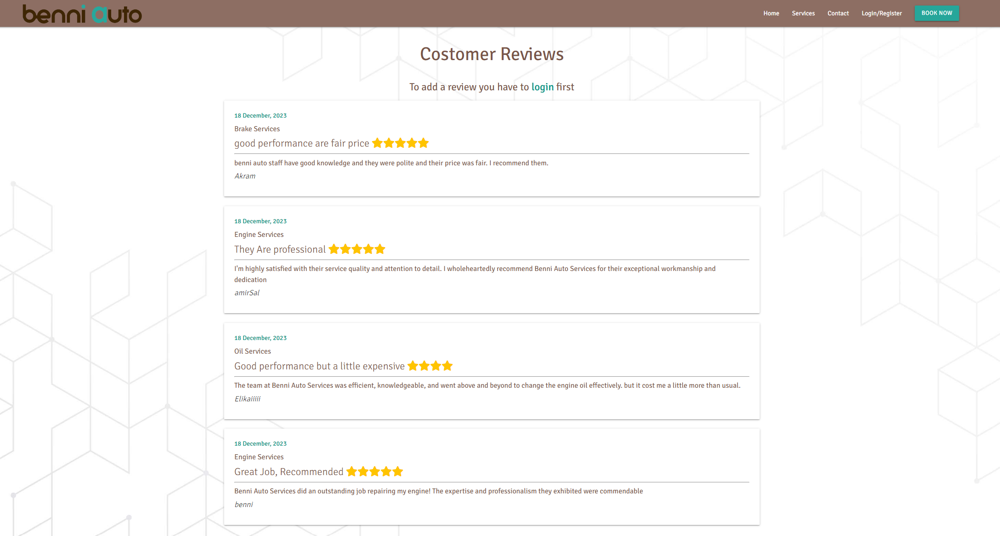
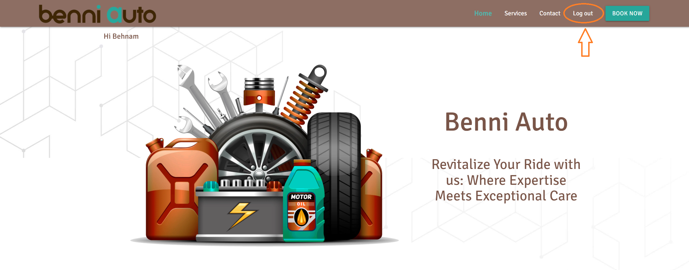

# Full Testing
## Contents
+ [Validator Testing](#validator-testing)
+ [PowerMapper Compatibility](#powermapper-compatibility)
+ [Testing From User Stories](#testing-from-user-stories)
+ [Manually Testing Functionality](#manually-testing-functionality)
+ [Responsive Testing](#responsive-testing)
+ [Bugs and Fixes](#bugs-and-fixes)
+ [Known Bugs](#known-bugs)
---
---
## Validator Testing
### **HTML**

 I checked all of the HTML pages using [W3C Markup Validation Service](https://validator.w3.org/)

 Because the code is made up of Jinja templates, I had to check from the live site by right clicking each page, selecting View Page Source and running that generated code through the validator.

 All pages passed all checks. 

### **CSS**

I checked the CSS file using [W3C CSS Markup Validation Service](https://jigsaw.w3.org/css-validator/)

Unfortunately, it returned 1 error:
+ the error relates to materializecss and due to I used CDN link, I cannot access to that.


Other than that, any other warnings were related to the vendor prefixes. 

### **JavaScript**

I checked the js files using [JSHint](https://jshint.com/)
There is no error in all js files.  

---
## Lighthouse Testing

After getting the bulk of the site in place, I ran it through Chrome Lighthouse. The initial scores were a bit low:


By the feed back given , I made a few changes to the code to raise the scores:

### **Performance**

+ Convert all images to webp format

### **Accessibility**

+ Add alt tags to all images
+ Add title to all links


---
---
## PowerMapper Compatibility

I used [PowerMapper](https://www.powermapper.com/) to test cross-browser compatbility on other browsers that I don't have access to.


According to their site, the ```backdrop-filter``` property had some browser compatibility issues:


I manually checked all of the browsers specified(apart from Internet Explorer) and found that, apart from Firefox, the ```backdrop-filter``` property did work:


Firefox definitely doesn't support the property so I manually tested it to make sure that, even without the blur filter, the site still looked okay and the text was legible


While it would be great to have the blur included, I still think that the look of the site holds up on firefox and all text remains legible. 

---
---
## Testing From User Stories

### As a casual user: 
+ *I want to be able to view the website home page and contact section.*

Even without being logged in, a user is able to browse through all the website:


Even without being logged in, a user is able to access the contact section and use make a phone call, or send and email:


+ *I want to be able to view services without having to register and account.*

Even without being logged in, a user is able to browse through all the service cards:


---

+ *I want to see all the reviews.*

The review page gives the user the ability to evaluate the quality of services from other users view, especially for the service they want to request:




---

+ *I want to have the option to register an account if I want to come back at a later date.*

From the navigation bar, the user can go to the Login/Register page. From there, If they dont have an account they can choose a register link and then by filling the register form with a unique username and email:


 If their chosen username or email has already been taken, they will be informed consequency and can choose another:

 
 


 If their chosen password is not same as the confirmed password, they will be notified to try again to fix it:
 


If these type of users try to book or write a review, they will be redirected to the login page.

---

### As a returning user: 
+ *I want to be able to log into my account.*

As long as the user has been through the registration process, they are redirected to login page to access their account with a flush message:


or if the user has already a registered acount, they can use the login page from the navigation bar to access the login form:


If they use the wrong username, they will be informed and can retry:


If they use the wrong  password, they will be informed and can retry:


And if both username and password are correct, users are redirected to the Home page with a greeting message includes their first name:


---

+ *I want to be able to see all my orders(Appointments).*

Users can reach to the order page from the navigation bar, plus buttons in services section in home page, service page and footer link:


Once they have clicked it, they will be redirected to the order page:


---
+ *I want to have ease of access to any orders that I have already booked.*

From their order page, the user will be able to view all orders that they have requested:


---

+ *I want to be able to add a service order (appointment).*

Once the user has been directed to the order page, by clicking the button "BOOK A NEW APPOINTMENT", the form of order will be shown up, Also there are two other access buttons in home page and service page to redirect the mentioned page:


Order Form:


If the user need recovery services, two more rows will be pop up and they are required to be filled:


---


+ *I want to be able to edit or cancel any orders that I have already booked.*

When the new order is booked the new row will be added to the orders. From there, the user can click on any of the orders and they are presented with the order information and also edit and cancel options:


**EDIT Order:**
if the user presses the edit button, the page reloads to the edit page which is a visual duplication of the order page. However, the input fields will be populated with their original input:


Once the user has made the necessary changes, they can confirm them at the bottom of the page. Alternatively, they can cancel all changes they've made. Both buttons lead back to their order page:


**Cancel Order:** if the user chooses the Cancel button, the user has to describe the cancelation reason and then cancel it. they will be presented with a modal to either confirm or cancel the cancelation: 


 
Once the order is canceled, the canceled badge will be shown up to the related order and cancel description will be replaced with order description, Users cannot change that and in case they want to book another order there is a button to redirect them to place a new order.


+ *I want to be able to leave a review.*

From the Home page and footer link, Users can access to review page. the review form will be pop up by click on the "LEAVE A REVIEW" button. 


Review Form:
Users also can choose the stars rate for their satisfication. 


+ *I want to be able to see my review and delete it.*

As soon as the review submitted, the review can be shown on the review page and main page. the date of the review is inserted automatically based on the review date. 


Users can access to delete their own reviews if they need. 


A modal will appear asking the users to confirm that they want to delete the selected review. They also have the option to 'Cancel' which will close the modal with no changes made:


+ *I want to Log out the website.*
By clicking on "Log out" button on navbar and footer links, Users can log out from their account. 



As soon as the user log out, a notification will be pop up and confirm the logging out the process. also, the navar items changed and the greeting text disapeared.


---

### As the site owner/admin:

+ The admin will be able to log into their account as every other user does 


+ *I want to be able to add new Services to the site.*

Once they're on the 'Services' page, they'll have access to the 'Add A New Service' button:


Once they click that, they'll be redirected to the add service page where they can fill in all of the service information.Once all of the inputs have been filled in correctly, the Admin can use the 'Add Service' button at the bottom of the page to add it to the database:


---

+ *I want the new services to be added to the appropriate site areas.*

The new service is added to the Service page:


The new Service is added to the home page service section: 


The new collection is added to the Service options in add order form:


The new collection is added to the Service options in add review form: 


---

+ *I want to be able to edit the pre-existing Services.*

From the 'Services' page, the admin can click on whichever Service they wish to edit and click the 'Edit' button:


This will redirect them to the edit page where they can update whatever information they want. However, the input fields will be populated with their original input:


Once the user has updated the information, they can access they buttons at the bottom of the form. If they click 'Edit Service', the changed will be sent to the database and be updated across the site. They also have the option to 'Cancel' which will ignore any changes and redirect them to the 'Services' page:


---

+ *I want to be able to delete any collections.*

From the 'Service' page, the admin can click on 'Delete' button of whichever Service they wish to delete:


A modal will appear asking the admin to confirm that they want to delete the selected service (include the service name to prevent any mistake). They also have the option to 'Cancel' which will close the modal with no changes made:


---
+ *I want to be able to manage the users orders.*

This part is the business center of the website where Admin can access to all the users orders: 


Admin has an option to edit or cancel the users order on behalf of them. 


Admin can Also delete the cancel order to tidy up the orders.


+ *I don't Want to be able to change or delete any reviews*

To respect the users rights, Admin cannot change or delete any reviews and Admin is just a viewer for this page. 


---
## Manually Testing Functionality
### **base.html**

| Element               | Action        | Expected Result| Pass/Fail  |
|:-------------         |:------------- |:-----|:-----|
| **NavBar**            |               |      |
|Logo                   |Click|Redirect to home         |Pass|
|Home Link              |Click|Redirect to home         |Pass|
|Book Now Link          |Click|Redirect to all Orders  |Pass|
|                       |     |(Not Applicable if user not in session)  |Pass|
|Book Now Link          |Click|Redirect to Log in page  |Pass|
|                       |     |(if user not in session)  |Pass|
|Services page link     |Click|Redirect to Service page|Pass|
|Login/Register Link    |Click|Redirect to Login page|Pass|
|                       |     |(Not visible if user in session)  |Pass|
|Log Out Link           |Click|Log user out of account an Redirect to Home page  |Pass|
|                       |     |(visible if user in session)  |Pass|
|Contact Link           |Click|Redirect to Contact section in Home page|Pass|
| **SideNav**           |     |                         |    |
|Hamburger Icon         |Click|Open Sidenav             |Pass|
|Home Link              |Click|Redirect to home         |Pass|
|Book Now Link          |Click|Redirect to all Orders  |Pass|
|                       |     |(Not Applicable if user not in session)  |Pass|
|Book Now Link          |Click|Redirect to Log in page  |Pass|
|                       |     |(if user not in session)  |Pass|
|Services page link     |Click|Redirect to Service page|Pass|
|Login/Register Link    |Click|Redirect to Login page|Pass|
|                       |     |(Not visible if user in session)  |Pass|
|Log Out Link           |Click|Log user out of account an Redirect to Home page  |Pass|
|                       |     |(visible if user in session)  |Pass|
|Contact Link           |Click|Redirect to Contact section in Home page|Pass|
| **Footer**            |     |     |
|Logo                   |Click|Redirect to home         |Pass|
|Home Link              |Click|Redirect to home         |Pass|
|Book Now Link          |Click|Redirect to all Orders  |Pass|
|                       |     |(Not Applicable if user not in session)  |Pass|
|Book Now Link          |Click|Redirect to Log in page  |Pass|
|                       |     |(if user not in session)  |Pass|
|Services page link     |Click|Redirect to Service page|Pass|
|Login/Register Link    |Click|Redirect to Login page|Pass|
|                       |     |(Not visible if user in session)  |Pass|
|Log Out Link           |Click|Log user out of account an Redirect to Home page  |Pass|
|                       |     |(visible if user in session)  |Pass|
|Contact Link           |Click|Redirect to Contact section in Home page|Pass|
|Reviews Link           |Click|Redirect to Reviews Page |Pass|

---
### **home.html**
| Element               | Action            | Expected Result           | Pass/Fail  |
|:-------------         |:-------------     |:-----                     |:-----|
| **Contact**           |                   |                           |    |
|Location/Map Link      |Click              |Redirect to the location in google Map|Pass|
|Email 1 Link           |Click              |Open Send email app        |Pass|
|Email 2 Link           |Click              |Open Send email app        |Pass|
|Phone Link             |Click              |redirect to call app       |Pass|
| **Inline Links**      |                   |                           |    |
|Our Services link      |Click              |Redirect to Services Page  |Pass|
|Reviews link           |Click              |Redirect to Reviews page     |Pass|
|See all reviews link   |Click              |Redirect to Reviews page     |Pass|
|+ link in services     |Click              |Redirect to Book an appointment page   |Pass|
|                       |   |(if user in session)  |Pass|
|+ link in services     |Click              |Redirect to Login page   |Pass|
|                       |     |(if user not in session)  |Pass|
---

### **login.html**

| Element                   | Action            | Expected Result                   | Pass/Fail  |
|:-------------             |:-------------     |:-----                             |:-----|
|**Form**                   |                   |                                   |    |
|Username                   |Text input         |Text displayed to user             |Pass|
|Password                   |Text input         |Password is hidden to user         |Pass|
|Show password icon         |Click              |Password is unveiled to user       |Pass|
|Login btn (fields correct) |Click              |Redirect to Home page              |Pass|
|Login btn (fields incorrect)|Click             |Reload login page                   |Pass|
|                           |             |Flush the error messages                  |Pass|
|Login btn(Username is not Found)|Click         |Reload register page, error message to user    |Pass|
|Login btn(Password  is not correct)|Click    |Reload register page, error message to user    |Pass|
|**Redirect Link**          |                   |                                   |    |
|'Register Now' link        |Click              |Redirect to Register page      |Pass|
---

### **register.html**
| Element                   | Action            | Expected Result                   | Pass/Fail  |
|:-------------             |:-------------     |:-----                             |:-----|
|**Form**                   |Click              |Redirect to previous page          |Pass|
|Text input fields          |Type into          |Text appears, line highlights green|Pass|
|Text input fields          |Leave blank        |Line highlights red                |Pass|
|Gender Options             |click and choose   |Gender selected                    |Pass|
|Email input                |Text input         |Email displayed to user            |Pass|
|Username                   |Text input         |Text displayed to user             |Pass|
|Password                   |Text input         |Password hidden to user            |Pass|
|Password                   |Text input         |Confirmed Password hidden to user  |Pass|
|**Register btn**             |                   |                                   |    |
|Fields correct             |Click              |New user added to database         |Pass|
|                           |                   |Redirect to Login page with greeting message |Pass|
|Fields incorrect format    |Click              |Fields highlighted red, user prompted to change format |Pass|
|Email already in use       |Click              |Reload register page, error message for email to user    |Pass|
|Username already in use    |Click              |Reload register page, error message for username to user    |Pass|
|Passwords are not same     |Click              |Reload register page, error message password to user    |Pass|
|**Reset btn**             |                   |                                   |    |
|Reset Button              |Click              |All data cleared         |Pass|
---

### **Services page**
| Element                   | Action            | Expected Result                   | Pass/Fail  |
|:-------------             |:-------------     |:-----                             |:-----|
|Service Card               |On page load       |display Service Cards              |Pass|
|Book Now btn              |Click              |Redirect to Book an appointment page|Pass|
|                       |   |(if user in session)  |Pass|
|Book Now btn              |Click              |Redirect to Login page   |Pass|
|                       |     |(if user not in session)  |Pass|
|ADD A NEW SERVICE btn     |Click              |Redirect to add_service page   |Pass|
|                       |     |(Visible/Applicable if Admin in session)  |Pass|
|Edit btn                  |Click              |Redirect to edit_service page   |Pass|
|                       |     |(Visible/Applicable if Admin in session)  |Pass|
|Delete btn                |Click              |Open Delete Modal Window   |Pass|
|                       |     |(Visible/Applicable if Admin in session)  |Pass|
|Delete modal - delete btn  |Click              |Delete selected Service         |Pass|
|                           |                   |Redirect to Services page   |Pass|
|                       |     |(Visible/Applicable if Admin in session)  |Pass|
|Delete modal - cancel btn  |Click              |Close modal with no change made    |Pass|
|                       |     |(Visible/Applicable if Admin in session)  |Pass|
---

### add_service.html
*Applicable if Admin in session*
| Element                   | Action            | Expected Result                   | Pass/Fail  |
|:-------------             |:-------------     |:-----                             |:-----|
| **Form**                  |                   |                                   |    |
|Text input fields          |Type into          |Text appears, line highlights green|Pass|
|Text input fields          |Leave blank        |Line highlights red                |Pass|
|Add Service btn (some incorrect fields)|Click   |Page shows incorrect fields   |Pass|
|Add Service btn (correct fields)|Click   |New Service added and redirect to services page   |Pass|

---
### **edit_service.html**
*Applicable if Admin in session*
| Element                   | Action            | Expected Result                   | Pass/Fail  |
|:-------------             |:-------------     |:-----                             |:-----|
| **Form**                  |                   |                                   |    |
|All fields                 |On page open       |Pre-populated with previous inputs |Pass|
|Text input fields          |Type into          |Text appears, line highlights green|Pass|
|Text input fields          |Leave blank        |Line highlights red                |Pass|
|Edit btn(all fields correct)|Click           |Service edits on database         |Pass|
|                           |                   |Redirect to Service page           |Pass|
|Edit btn(some incorrect fields)|Click        |Page shows the incorrect fields   |Pass|
|Cancel btn                 |Click              |No changes made to recipe          |Pass|
|                           |                   |Redirect to Service page           |Pass|
---

### **orders.html**
*Applicable if User in session*
| Element                   | Action            | Expected Result                   | Pass/Fail  |
|:-------------             |:-------------     |:-----                             |:-----|
|**Add A New Order**|                  |                                   |    |
|"BOOK A NEW APPOINTMENT" btn |Click              |Redirect to add_order page       |Pass|
|**Orders**                 |                   |                                   |    |
|Order rows                 |Click              |Orders expand and show details     |Pass|
|                       |     |(if any order submitted before)  |Pass|
|Expanded order             |Click              |close the expanded part            |Pass|
|Another Order row when an order is expanded |Click |close the expanded order and expand the new clicked row |Pass|
|Edit Order btn             |Click              |Redirect to edit_order page        |Pass|
|Cancel Order btn           |Click              |Redirect to cancel_order page      |Pass|
|Delete Order btn           |Click              |Open Delete Modal Window   |Pass|
|                       |     |(Visible/Applicable if Admin in session)  |Pass|
|Delete modal - Delete btn  |Click              |Delete selected order         |Pass|
|                           |                   |Redirect to orders page   |Pass|
|                       |     |(Visible/Applicable if Admin in session)  |Pass|
|Delete modal - cancel btn  |Click              |Close modal with no change made    |Pass|
|                       |     |(Visible/Applicable if Admin in session)  |Pass|
---

### add_order.html
*Applicable if User in session*
| Element                   | Action            | Expected Result                   | Pass/Fail  |
|:-------------             |:-------------     |:-----                             |:-----|
| **Form**                  |                   |                                   |    |
|Username                   |check              |Show the correct username          |Pass|
|Text input fields          |Type into          |Text appears, line highlights green|Pass|
|Text input fields          |Leave blank        |Line highlights red                |Pass|
|Service category option    |Click and select   |service category selected          |Pass|
|Car Brand Option           |Click and select   |Car Brand selected                 |Pass|
|Request Date input         |Click              |the calender is pop up             |Pass|
|Calender - Choose date     |Click              |Select the date within the workdays|Pass|
|Calender - Select btn      |Click              |Date selected and calender closed  |Pass|
|Calender - Cancel btn      |Click              |Calender closed without selecting the date|Pass|
|Toggle icon for Need Recovery|Click            |need recovery switched on and two more rows added to form|Pass|
|Text input fields          |Leave blank        |Line highlights red                |Pass|
|BOOK APPOINTMENT btn(all fields correct)|Click |New order adds to orders     |Pass|
|                           |                   |Redirect to orders page   |Pass|
|Add collection btn(some incorrect fields)|Click|Page shows the incorrect fields   |Pass|

---
### **edit_order.html**

| Element                   | Action            | Expected Result                   | Pass/Fail  |
|:-------------             |:-------------     |:-----                             |:-----|
| **Form**                  |                   |                                   |    |
|All fields                 |On page open       |Pre-populated with previous inputs |Pass|
|Text input fields          |Type into          |Text appears, line highlights green|Pass|
|Text input fields          |Leave blank        |Line highlights red                |Pass|
|Confirm Change btn(all fields correct)|Click           |Order updates in database     |Pass|
|                           |                   |Redirect to orders page   |Pass|
|Update btn(some incorrect fields)|Click        |Page shows the incorrect fields   |Pass|
|Cancel btn                 |Click              |No changes made to collection      |Pass|
|                           |                   |Redirect to orders page   |Pass|

---

### **cancel_order.html**

| Element                   | Action            | Expected Result                   | Pass/Fail  |
|:-------------             |:-------------     |:-----                             |:-----|
| **Form**                  |                   |                                   |    |
|Text input field           |Type into          |Text appears, line highlights green|Pass|
|Text input field           |Leave blank        |Line highlights red                |Pass|
|CANCEL ORDER btn(field correct)|Click     |Order cancels in database     |Pass|
|                           |                   |Redirect to orders page with canceled badge on order  |Pass|
|CANCEL ORDER btn(incorrect field)|Click  |Page shows the incorrect field   |Pass|

---

### **Reviews page**
| Element                   | Action            | Expected Result                   | Pass/Fail  |
|:-------------             |:-------------     |:-----                             |:-----|
|Login Link                 |Click             |Redirect to Login page              |Pass|
|                       |   |(Visible/Applicable if user not in session)  |Pass|
|LEAVE A REVIEW btn         |Click              |Redirect to add_service page   |Pass|
|                       |     |(Visible/Applicable if User in session)  |Pass|
|Reviews rows               |On page load       |display All the reviews    |Pass|
|DELETE COMMENT btn         |Click              |Open Delete Modal Window   |Pass|
|                       |     |(Visible/Applicable if Owner of review in session)  |Pass|
|Delete modal - delete btn  |Click              |Delete selected Review         |Pass|
|                           |                   |Redirect to Reviews page   |Pass|
|                       |     |(Visible/Applicable if Owner of review in session)  |Pass|
|Delete modal - cancel btn  |Click              |Close modal with no change made    |Pass|
|                       |     |(Visible/Applicable if Owner of review in session)  |Pass|
---

### add_review.html
*Applicable if User in session*
| Element                   | Action            | Expected Result                   | Pass/Fail  |
|:-------------             |:-------------     |:-----                             |:-----|
| **Form**                  |                   |                                   |    |
|Username                   |check              |Show the correct username          |Pass|
|Service category option    |Click and select   |service category selected          |Pass|
|Text input fields          |Type into          |Text appears, line highlights green|Pass|
|Text input fields          |Leave blank        |Line highlights red                |Pass|
|Star Rating                |Hover/click        |Starts colored                 |Pass|
|ADD REVIEW btn (some incorrect fields)|Click   |Page shows incorrect fields   |Pass|
|ADD REVIEW btn (correct fields)|Click   |New Review added and redirect to Review page   |Pass|

---

## Responsive Testing
Through devices that I have at home/readily available to me, I was able to continuously test on:
### Phone:
+ Samsung Galaxy S23 Ultra
  + Google Chrome
  + Samsung Internet
+ Google Pixel-8
  + Google Chrome
+ IPhone 15 Pro MAx
  + Safari
### Tablet
+ iPad Mini 7.9"
  + Safari
+ iPad 9.7"
  + Safari
### Computer
* Microsoft Surface Laptop 15"
  * Google Chrome
  * Microsoft Edge
  * Opera
  * Mozilla Firefox
### Responsinator
+ When there were devices/browsers that I didn't have access to, I used [Responsinator](https://www.responsinator.com/) to make sure that the site was responsive.

---
---